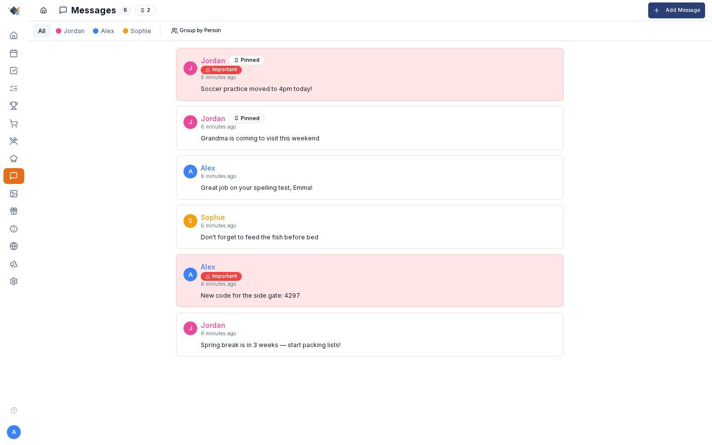

# Messages

{ .hero-image }

Family message board for shared updates. Lower-friction than texting (no notifications, no group chat noise), more persistent than a sticky note on the fridge. Built for the "drop a note that everyone will see when they walk past the wall display" pattern.

---

## What a message has

- **Message text** — what you're saying. Up to 500 characters (a live counter shows remaining length while posting/editing).
- **Author** — whoever was logged in when it was posted.
- **Pinned** — boolean. Pinned messages sort to the top regardless of age.
- **Important** — boolean. Renders with red accent / icon for visual emphasis.
- **Expires at** — optional timestamp. After the window passes the message is hidden from all views (filtered server-side on read); the row stays in the database.
- **Created at** / **Updated at** — auto.

---

## Posting

Two ways:

1. **From the dashboard MessagesWidget** — the **+** (Add message) button opens the Post Message dialog.
2. **From the full Messages page** — *nav → Messages* → input at the top.

Both require login. The author is auto-set to the logged-in user; you can't impersonate someone else.

---

## Expiration

Pick from a dropdown when posting:

- **No expiration** (default).
- **12 hours**
- **1 day**
- **2 days**
- **3 days**
- **7 days**

Useful for temporary notices: "Pizza in the fridge from tonight" (expires in 12h), "Snow day — no school" (expires in 1d), "Hosting brunch Sunday, RSVP by Friday" (expires in 3d).

Once a message's expiration window passes it is hidden from every view (the server filters expired rows out on read). The rows themselves remain in the database — there is no periodic purge job.

---

## Pinning

Pinning is chosen **when you post**, via the **Pin to top** checkbox in the Post Message dialog. There is currently no in-list pin/unpin toggle — to change a message's pinned state you re-post it. Pinned messages:

- Sort to the top of the list (above everything, regardless of age).
- Render with a slight visual highlight (pin icon, subtle background tint).

Pin the standing-house-rules-style notes ("WiFi: TacosForever42", "Gate code: 4297").

---

## Important flag

Mark a message **important** for visual emphasis:

- Red icon / accent next to the message.
- Slightly darker background tint.
- Reads as a louder version of "you should look at this."

Independent from pinning — a message can be pinned + important, just pinned, just important, or neither.

---

## Editing

Hover over a message (or tap on mobile) to reveal the **pencil icon**. Click to edit in place:

- Text becomes an inline editable textarea.
- **Ctrl+Enter** to save.
- **Escape** to cancel.
- The author + created-at stay; `updated_at` refreshes.

Anyone can edit their own messages. Parents can edit any message.

---

## Deleting

Trash icon on each message (visible on hover/long-press):

- **Authors** can delete their own messages.
- **Parents** can delete any message.
- Children cannot delete others' messages.

A confirmation dialog ("Delete this message?" / "This action cannot be undone.") appears before the message is removed. Deletion is permanent — there is no undo.

---

## Group by person

The Messages page has a **Group by Person** toggle:

- **Off** — one chronological list, newest first (pinned first within that).
- **On** — messages organize into person-colored cards (one card per family member). Each card shows that person's recent messages.

Group-by mode is useful when you have a lot of message traffic and want to see "what has Jordan posted recently?" at a glance.

---

## Dashboard MessagesWidget

The widget shows the most-recent N messages with:

- Author avatar + name (color-coded).
- Message text (truncated if very long; tap to expand).
- Pinned / important badges where applicable.
- A **+** (Add message) button that opens the Post Message dialog. There is no inline text input on the widget.

Sized for a corner of the dashboard.

---

## Use cases

### Standing house info

Pin notes for things everyone should always be able to find:

- WiFi password.
- Door / gate codes.
- Trash + recycling pickup day.
- House rules.
- "If something breaks, the breaker box is in the garage."

These pinned messages function as a lightweight house wiki.

### Time-sensitive announcements

Expire-in-1-day messages for things that matter today and not tomorrow:

- "Pizza in fridge from tonight."
- "Don't use the upstairs shower — fixing it Wednesday."
- "Mom's at the dentist 'til 3."

### Encouragement / "great job"

A throwaway "Great job on your spelling test, Emma! 🌟" lands in the family's space without needing a phone notification.

### Coordination between parents

Sometimes you and your spouse need a shared note that's more durable than a text. Posting "Grandma is coming Sunday" as a message ensures both of you see it next time you walk past the dashboard, and you can pin it until she's gone.

---

## Privacy

Messages are family-internal — only logged-in family members see them. The babysitter and away-mode views do not show messages.

Messages live in your Prism database. No external sync to MS To Do, Google, or anywhere else (intentionally — messages are ephemeral; they're not lists, they don't belong in a task-tracking system).

---

## Troubleshooting

### Message vanished after a few hours

Most likely an expiration was set. Check the expiration dropdown when posting — default is "No expiration."

### Edit pencil doesn't appear

Either:
- Not logged in. (Messages are read-only when no user is authenticated.)
- Not the author and not a parent. Children can't edit others' messages.

### Message order looks weird

Sort is: pinned first (within pinned, newest first), then non-pinned by created_at descending. If you're seeing different order, you're probably looking at the per-person grouped view — each person's section sorts independently.

### Important badge color clashes with theme

The important-message accent uses your theme's destructive color (typically red). On the default light theme it's pure red; on dark theme it's slightly muted. Custom theme palettes may override — check *Settings → Appearance*.
