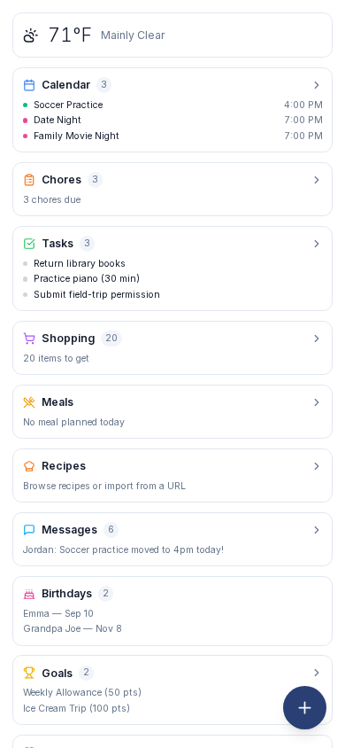

# Mobile & PWA

{ .hero-image-mobile width="300" }

Prism is built as a Progressive Web App (PWA) that adapts to whatever you install it on: phone, tablet, kiosk, or wall-mounted display. Same code, same data, different UI surface depending on screen size, orientation, and pointer type.

---

## Installation

### iOS (Safari)

1. Open Prism in Safari.
2. Tap the **Share** button.
3. Select **Add to Home Screen**.
4. Tap **Add**.

The app opens without browser chrome (no URL bar, no Safari toolbar). Standard iOS PWA: supports notification badges, theme color, splash screen.

### Android (Chrome / Edge)

1. Open Prism in Chrome.
2. Tap **Menu** (three dots) → **Install app** (or **Add to Home Screen** on older versions).
3. Confirm.

App launches standalone, full screen.

### Desktop (Chrome / Edge / Brave)

1. Open Prism in the browser.
2. Click the **install icon** in the address bar (the small `+` or computer icon).
3. The app opens in its own window without browser chrome.

Useful for a dedicated dashboard machine: pin to taskbar, set to launch on startup.

---

## App icon shortcuts (Android + desktop Chromium)

Long-press the app icon (or right-click on desktop) for quick-jump shortcuts:

- **Shopping**
- **Tasks**
- **Messages**

Custom shortcuts can be added by editing `public/manifest.json`.

---

## Service worker + offline support

The service worker (`public/sw.js`) precaches static assets:

- App shell (the `_next` static assets: CSS, JS chunks) is precached on install.
- The start URL (`/`) is served **network-first**, falling back to the cached copy when offline.

That's the extent of it. There is **no** API-response caching, **no** offline mutation queue, and **no** background-sync retry. Prism is not an offline-first app. If the device is offline, expect to refresh manually once you're back online, and don't expect changes made while offline to be captured.

---

## Navigation by surface

Prism uses three different nav components depending on screen size + orientation:

| Layout | Component | When |
|---|---|---|
| **SideNav** | Collapsible left sidebar | Landscape desktop / large tablet. Default for most kiosks. |
| **PortraitNav** | Bottom drawer + sliding panel | Portrait tablets. Bottom bar with drawer that slides up for more pages. |
| **MobileNav (FAB)** | Floating action button | Phone viewports. Replaces bottom nav with a single floating button. |

The `AppShell` component picks the right nav based on the active viewport + orientation. Switching orientation triggers a re-evaluation.

### FAB (phone PWA)

The Floating Action Button is a single circular button in the bottom corner. Tap it to expand a small menu. Which actions appear depends on the current page:

Always available:

- **Home**: back to dashboard.
- **Settings**: opens the full Settings page.
- **Login / Logout**: switch users (shows **Login** when logged out).

On the dashboard only:

- **Reorder**: drag cards on the dashboard into your preferred order.
- **Cards**: show/hide dashboard cards (plus layout + theme controls, see below).

On the Shopping page only:

- **Scan Barcode**: scan an item into the active list.

Designed to use minimum screen space and stay out of the way during regular use.

### Card reorder mode

In FAB → Reorder, dashboard cards become draggable with grip pills on each one. Drag to reorder, tap **Done** to save. Persists per user.

### FAB → Cards

FAB → Cards shows a toggle for each available card. Turn off cards you don't use (e.g. Bus Tracker if you don't have one). Hidden cards don't render at all. Saves render cycles on a phone.

The same panel also carries two extra controls:

- **Layout**: switch the mobile dashboard between **Rows** and **Tiles**.
- **Theme**: cycle **Light / Dark / Auto**.

---

## Mobile dashboard

On phones, the full dashboard grid collapses into a single-column summary card layout:

- **Weather card**: current temp + conditions + a small forecast strip.
- **Calendar card**: agenda-only, next 5 events.
- **Tasks card**: top 5 incomplete tasks.
- **Shopping card**: top 5 active list items.
- **Chores card**: pending chores for everyone.
- **Meals card**: today's planned meals.
- **Messages card**: last 3 messages.
- **Birthdays card**: upcoming birthdays.

These eight are the defaults. **Clock, Bus Tracker, Recipes, Goals, Wishes, and Photos** are also available and can be turned on via FAB → Cards.

Tap any card to navigate to the full page for that feature. The cards are reorderable + can be individually hidden via the FAB controls.

---

## Calendar on mobile

The calendar collapses to **agenda view only** on phone viewports:

- View switcher hidden.
- Day/Week chevron navigation hidden (no-op for agenda anyway).
- Today button hidden.
- Header reads "Upcoming Events" instead of the date.
- `useEffect` forces agenda mode on mobile regardless of what was last selected on desktop.

Why: the multi-week + month + schedule grid views don't fit comfortably on a phone, and on the go what you actually want is the agenda.

---

## Touch targets + interactions

All interactive elements meet or exceed the **44px touch target** minimum (Apple HIG standard, also Material Design's recommendation). Buttons, list rows, checkboxes, drag handles: everything is sized to be tappable without precision.

Common gestures:

- **Tap**: primary action. Shopping items toggle, calendar cards open, dashboard cards navigate.
- **Long-press**: secondary actions (edit, delete, drag). Some lists also use long-press for drag activation so vertical scrolling stays the default.
- **Swipe left/right**: navigate calendar periods. 50px threshold so accidental swipes during scroll don't trigger.

---

## Responsive font sizes

Font scale adapts to the device class:

```css
html { font-size: 16px; }                                        /* phone default */
@media (pointer: fine)                       { font-size: 14px; }  /* desktop mouse */
@media (min-width: 768px)  and (pointer: coarse) { font-size: 18px; }  /* tablet touch */
@media (min-width: 1024px) and (pointer: coarse) { font-size: 20px; }  /* large tablet */
@media (min-width: 1400px) and (pointer: coarse) { font-size: 22px; }  /* kiosk */
```

The `pointer: fine` vs `pointer: coarse` media query distinguishes mouse-controlled (desktop laptop) from touch (tablet kiosk) at the same screen size. Same physical 13" display gets 14px on a laptop (mouse) but 20px on a tablet (touch).

Override globally via *Settings → Appearance → Font Scale* (planned, not yet shipped as of v1.8).

---

## Orientation detection

The `useOrientation` hook listens to `resize` + `orientationchange` events and returns the current orientation. The `AppShell` re-evaluates nav choice on every orientation change.

Set an orientation in *Settings → Appearance → Orientation Override* (Landscape / Portrait / Auto). Note this override only drives **photo and wallpaper orientation matching**. It does not change which navigation or layout is shown. The nav still follows the physically detected orientation (width vs height).

---

## Screensaver + Away mode behavior on PWA

PWA installations **auto-disable** screensaver and Away mode. Rationale:

- Phone PWAs don't have idle states the way kiosks do. Your phone is either in your pocket or actively in use.
- Auto-activating Away mode on a phone would lock the family member out of their own device.
- Screensaver photo slideshow on a phone screen is wasted battery.

The `useIsPWA` hook detects standalone display mode and short-circuits both.

If you specifically want the screensaver on a phone (rare, maybe a kid's bedside iPad), turn off PWA mode by opening Prism in the browser instead of the installed app.

---

## Notification badges (planned)

iOS 16+ and Android Chrome support PWA notification badges (the little number next to the icon). Prism doesn't currently set badge counts, but the infrastructure is in place, tracked as a follow-up to surface unapproved chores or unread messages.

---

## Common workflows

### Phone in pocket, occasional checks

Install as PWA on the phone. Default opens to dashboard summary cards. Tap a card to dive into the full feature. Use the FAB to switch users when needed.

### Tablet permanently mounted in the kitchen

Don't install as PWA. Open in fullscreen Chrome or use kiosk mode. SideNav stays visible, no nav restrictions, dashboard grid + Calendar + Shopping all accessible. Set orientation override to whatever the mount uses.

### Phone in shopping mode at the grocery store

Install as PWA. Open Shopping. Hit the maximize icon (top right) to enter shopping mode: full screen, no nav, tap items to strike through. Camera icon in the header to scan barcodes.

### Spouse uses iOS, you use Android

Both install as PWA on their own devices. Different shopping mode preferences, different filter presets, but the same data, the same family. PIN-based login means switching users on a shared device (e.g. the kitchen tablet) is a tap + a per-member PIN (4 or 6 digits).

---

## Troubleshooting

### "Install" prompt missing

PWA install criteria: served over HTTPS, valid manifest, valid service worker, not already installed. If the install prompt doesn't appear in Chrome, check the address bar for the install icon (small `+`), or DevTools → Application → Manifest for errors.

iOS Safari doesn't show a "Install" prompt at all. Install is always via Share → Add to Home Screen.

### Updates not showing after a deploy

The service worker caches aggressively. After a deploy:

- Force-refresh: hard reload (Ctrl+Shift+R on desktop, pull down + hold in Chrome on mobile).
- Or: uninstall the PWA, reinstall.
- Or: DevTools → Application → Service Workers → Update / Unregister.

The service worker is configured to skip-waiting on new versions, so reloads usually pick up the update within seconds. But sometimes a cached page sticks.

### Bottom nav covers content

Mobile pages have extra bottom padding to clear the nav bar. If you see overlap, file an issue with the specific page: almost always a missing `pb-20` (or equivalent) on a recently-added page.

### Calendar showing month view on phone (not agenda)

The agenda-only restriction was added in v1.8. If you're seeing month view on your phone, you're on an older client build. Hard-refresh.

### FAB missing

FAB only shows on phone viewports (`max-width: 767px`). On tablets you should see PortraitNav (bottom drawer) instead. The FAB is present on phone viewports whether or not anyone is logged in. When logged out it simply offers a **Login** action.

### Cards in mobile dashboard appearing in wrong order

Did you customize the order in FAB → Reorder? It persists per user. Switching users will load that user's saved order. Tap FAB → Reorder → drag → Done to reset.

### Service worker registration fails

Usually a service-worker file path issue. Check DevTools → Console for `Failed to register a ServiceWorker` errors. The `public/sw.js` must be served from the root scope (`/sw.js`). If you've moved it, the registration in the app entrypoint needs updating.
