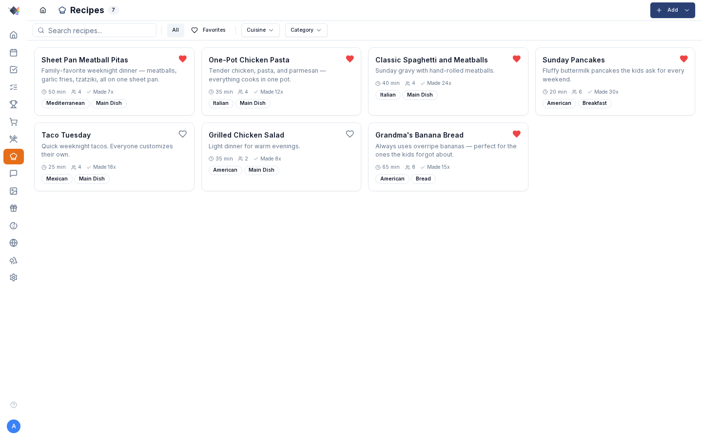

# Recipes

{ .hero-image }

Browse, import (URL, Paprika, paste-text), photograph, scale, and cook recipes — designed for a large kitchen screen so you don't have to keep unlocking your phone while your hands are covered in flour.

---

## What's in a recipe

Each recipe has:

- **Name** (required)
- **Description**
- **Ingredients** — structured as an array of `{ text }` or `{ heading }` entries. Headings render bolded; text entries are the actual ingredients.
- **Instructions** — plain text, line-breaks become step separators.
- **Prep time + cook time** (minutes)
- **Servings**
- **Cuisine** (Italian, Mexican, Thai, etc.)
- **Category** (Main Dish, Dessert, Breakfast, Bread, etc.)
- **Tags** — free-form (`weeknight`, `kid-friendly`, `vegetarian`, `sheet-pan`).
- **Source URL** — optional link back to the original.
- **Image** — uploaded photo OR remote URL.
- **Rating** (1-5 stars)
- **Notes**
- **Favorite** boolean
- **Times made** counter (auto-increments when a meal linked to this recipe is marked cooked)
- **Last made** timestamp

---

## Importing recipes

Four methods cover ~95% of inputs — plus a fifth for syncing from an existing recipe manager:

### URL import

*Recipes → Add → Import from URL.*

Paste a recipe URL. Prism parses **schema.org Recipe JSON-LD** (the standard structured-data format that most major recipe sites publish for SEO). Works with AllRecipes, NYT Cooking, Food Network, Bon Appétit, Serious Eats, Smitten Kitchen, and ~80% of indexed recipe sites.

Extracts: name, ingredients, instructions, prep/cook times, servings, image URL, cuisine, category.

If the site doesn't publish JSON-LD, the import fails gracefully — fall back to paste-text or manual entry.

### Paprika import

*Recipes → Add → Import from Paprika.*

For users migrating from Paprika. Export your Paprika library as HTML, paste into the Prism import dialog, parsed and added in bulk. HTML payload capped at 5 MB to prevent memory exhaustion.

### Paste recipe text (OCR-friendly)

*Recipes → Add → Paste recipe text.*

The killer feature for physical recipe cards. Workflow:

1. Take a photo of the recipe card with iOS Live Text (or Google Lens on Android).
2. "Select all → Copy" the recognized text.
3. Open Prism on your phone (or wherever you keep your laptop), paste into the modal.
4. A heuristic parser splits the dump into title, ingredients, instructions, prep/cook time, and servings — preserves section headings inside ingredients.

What the parser handles:

- **Title casing** — applies AP-style title case (`a / an / the / and / or / for / of / with` stay lowercase mid-title; everything else capitalized).
- **Section markers** — `Ingredients:`, `Instructions:`, `Method:`, `Directions:`, `For the X:` headers.
- **Sub-section headings inside ingredients** — `Fries:`, `Meatballs:`, `Sauce:` get stored as `{ heading }` entries and render bolded in the detail view.
- **"Step N:" prefixes** — split as instruction steps.
- **Comma modifiers in ingredients** — `1 onion, diced and sautéed` is preserved as-is.
- **`" or "` alternatives** — `1 tsp dried oregano or 1 tbsp fresh oregano` preserved.
- **Parentheticals** — `(about 4 cups)` preserved.
- **Inline step markers** — `1. Preheat oven. 2. Mix dry ingredients.` gets line-broken.
- **Times** — `Prep: 15 min`, `Cook: 30 min`, `Total: 45 min`, `Servings: 4` extracted.

Pre-fills the same form the manual-entry modal uses, so you can review + tweak before saving.

### Manual entry

The fallback. *Recipes → Add → Create manually*. Full form for every field. Use the same `{ heading }` syntax in the ingredients textarea (`Fries:` on its own line) to get bolded section headings in the detail view.

### Sync from Tandoor / Mealie

*Recipes → Add → Sync recipes (Tandoor / Mealie)…*

If you already keep your recipes in [Tandoor](https://tandoor.dev/) or [Mealie](https://mealie.io/), connect the server with its base URL and a **read-only API token** to pull recipes in.

- Sync runs a **review-and-approve diff**: adds and updates are pre-selected, and removals are opt-in (with a mass-delete guard so a misconfigured source can't wipe your library).
- Re-syncing is **idempotent** — recipes already imported are matched and updated in place rather than duplicated.

---

## Per-recipe photo upload

Each recipe can carry its own image. In the recipe form:

- **Upload from device** — opens the native photo picker. On iOS, shows the standard sheet (camera / library / files); doesn't force the camera (`capture="environment"` was intentionally removed).
- **Remote URL** — paste a URL to use it directly.
- **Remove** — clears the photo.

Uploaded photos go through a sharp pipeline:

- Auto-rotate from EXIF orientation.
- Resize to max 1200×1200 (preserves aspect ratio).
- Re-encode as JPEG, quality 85.
- Magic-byte validated (rejects non-image uploads).
- ≤10 MB cap.

Stored at `data/recipe-images/<recipeId>.jpg`. Served via `GET /api/recipes/<id>/image`. Rate-limited.

The image appears in the recipe card on the gallery view and at the top of the detail modal.

---

## Browsing + filtering

The Recipes page shows a grid of recipe cards with image, name, cuisine, category, and cook time. Heart icon flags favorites.

Filters:

- **Search** — case-insensitive match across name, description, cuisine, and category.
- **Cuisine** dropdown.
- **Category** dropdown.
- **Favorites only** toggle.
- **Clear filters** button.

Click any card to open the detail modal.

---

## Recipe detail modal

Click a recipe card to open the detail view. Features:

### Header

- Recipe name, cuisine + category badges, prep/cook time.
- **Favorite toggle** (heart).
- **Maximize** — expand to a larger modal for a wall display.

### Servings + scaling

The servings line shows current servings with **+/- buttons** to adjust by 1. Below them are five quick-scale pills:

- **½× / 1× / 2× / 3× / 4×**

Tap any pill to instantly multiply the original servings by that factor. ½× rounds up to the nearest whole serving so a 3-serving recipe scales to 2, not 1.5. The active multiplier highlights so you know what you're seeing.

Ingredient quantities auto-recalculate. Smart fractions: scaled amounts that hit common fractions display as fractions (rendered as ASCII — `1/4`, `1/3`, `1/2`, `2/3`, `3/4`); otherwise as numbers rounded to two decimal places.

### Ingredients

- Section headings render bolded.
- Tap an ingredient row to strikethrough — useful while cooking ("got this one in the bowl").
- Strikethroughs reset when you close the modal.
- Scaled quantities are reflected in the displayed text.

### Instructions

- Step-by-step, one line per step.
- Line breaks preserved from the source.
- `whitespace-pre-wrap` rendering — long steps wrap cleanly.

### Add to shopping list

- **Add to Shopping List** dropdown — pick which list to send the ingredients to.
- Active scaling applies — if you're viewing the recipe at 2×, the shopping items go in at 2× quantities.
- Section headings are filtered out automatically (they're visual grouping, not items to buy).

### Notes + URL

- Notes field renders below instructions.
- "View original recipe" link if the recipe has a source URL.

---

## Meal integration

Recipes link to meals on the Meals weekly planner:

- In the Add/Edit Meal modal, the **Recipe** picker is a searchable dropdown.
- Selecting a recipe auto-fills: meal name, description, prep time, cook time, recipe URL.
- Marking a meal as **cooked** increments the linked recipe's `timesMade` counter and updates `lastMadeAt`.

You can also schedule straight from a recipe: the detail modal has an inline **Add to Meal Plan** mini-calendar. Pick a day on the 2-week grid, choose a meal type (Breakfast / Lunch / Dinner / Snack — defaults to Dinner), and tap **Add to Plan** to drop the recipe onto the meal planner.

Each recipe card shows a **Made N×** badge once it's been cooked, so you can eyeball what's in rotation vs. what's been gathering dust.

---

## Print + share (planned)

Currently the detail modal is the only "share" — you can show someone the screen or save the page URL. A dedicated print stylesheet and a shareable read-only link are on the roadmap but not shipped.

---

## Troubleshooting

### URL import returns "no schema.org Recipe data"

The site doesn't publish structured data. Falls back to plain text scraping in some cases, but most often you'll need to use paste-text instead.

### Paste import got the title wrong (no caps / weird caps)

The title-case heuristic uses a stop-words list (`a, an, the, and, or, for, of, with, in, on, at, to, by`). Edit the title manually in the form before saving.

### Paste import didn't split into steps

The parser looks for `\d+\.\s` (numbered steps) or `Step N:` prefixes. Bullet-point instructions without numbers fall through to a single text block. Re-paste with explicit `1.`, `2.`, `3.` numbering or manually break into steps in the form.

### Recipe scaling rounded oddly

Smart fractions only kick in for ¼, ⅓, ½, ⅔, ¾ (shown as ASCII: `1/4`, `1/3`, `1/2`, `2/3`, `3/4`). Other scaled values show as numbers rounded to two decimal places (`0.67 cup`). If precision matters, override manually before sending to the shopping list.

### Photo upload "Failed to remove photo"

Real error from the API — earlier versions returned generic "Failed" without surfacing the actual cause. Updated to propagate the real reason in v1.8.

### Photo doesn't show on web (only on phone)

Stale cache. Hard-reload (Ctrl+Shift+R) or uninstall+reinstall the PWA. Images are served via `GET /api/recipes/<id>/image` and the response has a cache-busting query param — but a service worker with an aggressive cache can override.

### "Add to Shopping List" returns "too many requests"

Rate limit. Recipe imports add ingredients one-by-one in sequence, and long lists can briefly exceed the 120/min cap. Wait a minute and retry. Properly batched endpoint is a follow-up.

### Section headings appearing as ingredients on the shopping list

Shouldn't happen — headings filter out via the `{ heading }` field. If they do, the recipe probably has `Fries:` typed as a `{ text }` entry (an actual ingredient). Edit the recipe and re-format with the section as a heading.
