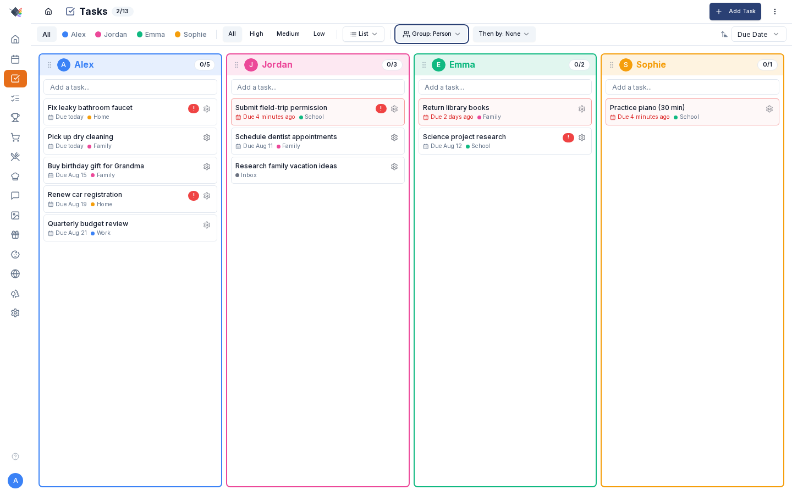

# Tasks

{ .hero-image }

To-do items with assignment, due dates, priorities, lists, and bidirectional sync to either Microsoft To Do or Google Tasks. Pick whichever your family already uses; same UI in Prism either way.

---

## What's in a task

- **Title** (required)
- **Description** — not editable in the Prism task modal; it only round-trips from Microsoft To Do / Google Tasks notes on sync.
- **List** — which task list it belongs to. Nullable (inbox).
- **Assigned to** — family member, or unassigned.
- **Due date** — date+time, optional.
- **Priority** — high / medium / low. Defaults to medium; there is no "none".
- **Category** — free-form tag (`Health`, `School`, `Errands`, `Shopping`).
- **Completed** — boolean. When completed, `completedAt` and `completedBy` populate.

---

## Task lists

Lists are the primary organizational unit. Common patterns:

- **Inbox** — catch-all for unsorted tasks.
- **Family** — household-shared (groceries, errands).
- **Home** — house maintenance, repairs.
- **Work** — per-parent work tasks.
- **School** — per-child school tasks.

Create lists in *Settings → Integrations → (Google or Microsoft) card → New List*. Each list has:

- **Name**
- **Color** — colored dot in the picker + per-task tag.
- **Sort order** — drag to reorder in the picker.
- **External sync source** — optional Microsoft To Do or Google Tasks list to bidirectionally sync with.

Delete a list and its tasks become unassigned (moved to the inbox); they're not deleted.

---

## Adding tasks

- **Add Task** button — opens the modal with all fields.
- **Inline text input** — at the top of the Tasks page, type a title, press Enter, task created in the current filter view.

Both require login (parent or child). The inline form auto-assigns the current logged-in user as `createdBy`.

---

## Completing tasks

Tap the checkbox to mark complete. The row strikes through and dims. The undo button in the nav bar lets you reverse the check for ~5 seconds.

If the task syncs to MS To Do / Google Tasks, the completed status propagates to the external provider on the next sync cycle.

---

## Filtering + sorting

- **By list** — picker dropdown, "All lists" / "Unassigned" / specific list.
- **By person** — avatar filter pills at the top.
- **By priority** — filter chip.
- **Show completed** toggle — off by default. When on, completed tasks appear at the bottom with the strikethrough.

Sort options:

- **By due date** — overdue first, then today, then upcoming, then no-date last.
- **By priority** — high → medium → low.
- **By title** — alphabetical (A→Z).

---

## Grouping

The Group dropdown supports nested grouping:

- **None** — flat list.
- **By Person** — cards per family member.
- **By List** — cards per task list.
- **Then by** secondary group — when the primary group is Person, you can also sub-group by List (or vice versa). Sub-groups render as colored left-border dividers inside the primary group card.

The drag-reordered order of the group columns persists to localStorage (`prism:task-group-order` when flat-grouped, `prism:task-nested-group-order` when nested). The chosen grouping mode itself is not persisted.

---

## Reordering

Drag-and-drop within a group (touch + mouse). Note there is no per-task order persistence — only the drag order of the group columns is stored (see Grouping).

For cross-list moves, drag a task onto a different list's card header to reassign.

---

## Sync providers

Pick one provider per Prism instance:

### Microsoft To Do (bidirectional)

1. *Settings → Integrations → Microsoft* card — connect your account.
2. In the same card, for each Prism list pick an MS To Do list to sync it with.

Bidirectional, newest-wins. Fields synced: title, notes (= description), completed, due date. Subtasks in MS To Do are flattened into the notes field (Prism doesn't have a subtask concept).

### Google Tasks (bidirectional)

1. *Settings → Integrations → Google* card — connect your account (same Google OAuth used for Calendar — Tasks scope added).
2. In the same card, pick which Google Tasks list maps to which Prism list.

Same shape as MS — bidirectional, newest-wins, title + notes + completed + due date.

### Auto-sync

- Fires on dashboard mount if last sync is stale (>5 minutes ago).
- Background sync every 5 minutes via the polling hook.
- Pauses when the browser tab is hidden.
- Re-fires on visibility return.
- Also covers the screensaver mode when the Tasks widget is shown.

Manual sync button always available — useful right after adding a task on the other side.

---

## Undo

A global undo stack covers tasks, chores, shopping items, and wishes. After completing or deleting a task, an **Undo** button appears in the nav bar for ~5 seconds. Tap to reverse the most recent action.

---

## Mobile behavior

- Single-column layout.
- Compact header.
- Collapsible filters — tap "Filters" to expand/collapse.
- GripVertical drag icons hidden (touch-drag uses long-press on the row).
- Card-level drag disabled so vertical scroll works naturally; item-level drag still works.

---

## Common workflows

### Recurring chore that's really a task

Sometimes "Take out trash every Friday" is more of a personal todo than a points-eligible chore. Add it as a task with a weekly due date in the Home list. When you complete it, manually duplicate it with next Friday's date.

(Native recurring-task support isn't shipped — it's tracked as a follow-up.)

### Grocery list as tasks

Some families prefer the Shopping page; others would rather have everything in one task list. The Microsoft To Do sync lets shopping items flow into a To Do list automatically — see the [Shopping guide](SHOPPING.md) for the per-list sync config.

### Sharing a list with a non-Prism family member

The MS To Do / Google Tasks sync is the bridge. Share the Microsoft/Google list with the other person on their side; they see and edit in MS To Do or Google Tasks, you see the same data in Prism via the sync.

---

## Troubleshooting

### Tasks not syncing

1. *Settings → Integrations → (Google or Microsoft) card* — is the provider still connected?
2. In the same card — is the per-list connection enabled?
3. Tap **Sync now** to force a refresh.
4. Check the external list directly — does it have the task you expect?

### Two-way sync created duplicates

Usually a one-time glitch when a task was created in both places before the first sync ran. Delete the duplicate; the deletion propagates.

### Completed task came back uncompleted

The external system marked it incomplete and the newest-wins resolver applied that update. Check what happened on the external side; mark complete again if you want it gone.

### "Create List" button missing

Lists are created from *Settings → Integrations → (Google or Microsoft) card → New List*. There's no inline list-creation button on the Tasks page; the picker only shows existing lists.

### List deletion deleted my tasks

It shouldn't — tasks become unassigned (inbox) when a list is deleted. If tasks did disappear, check the audit log (*Settings → Activity Log*) for the actual operation.

### Sub-grouping (Person → List) looks weird

The nested group view is opinionated about visual hierarchy: primary group as the card, sub-groups as colored-left-border dividers. If the nested mode confuses the layout, switch to a single grouping level or "Group: None" and sort instead.
